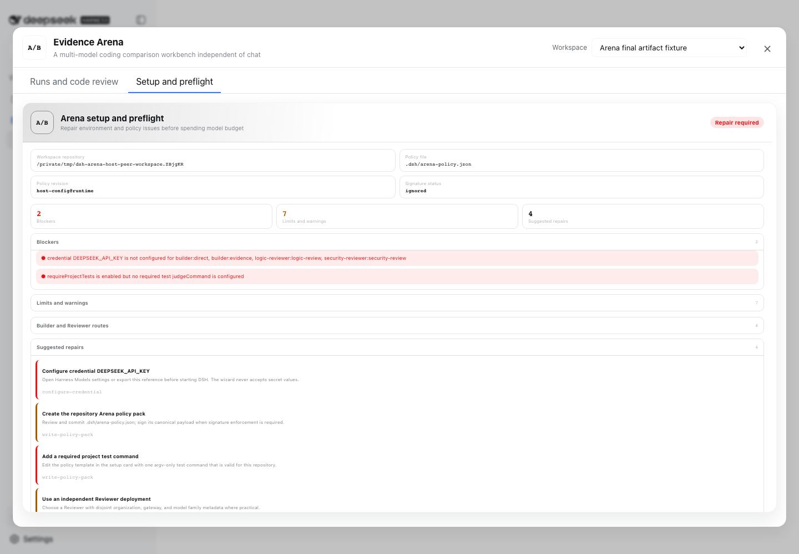

# dsh-evidence-arena

English | [中文](README.zh.md)

Evidence Arena is a **multi-model coding comparison workbench independent of chat Sessions**. Two or three Builders solve the same task in isolated Git worktrees and independent DSH child runtimes. Reproducible gates, independent Reviewers, and per-file diffs make the results inspectable. Only an explicitly confirmed candidate is written back to the original workspace.



## Delivery status

| Question | Current answer |
|---|---|
| Does it require patches to official DSH Host, command, Session, or chat UI source? | **No.** It uses only the plugin manifest, Host RPC, Workspace Registry, `sidebar.footer.action`, and `shell.overlay`. |
| Where is it opened after installation? | The **A/B** action at the bottom of the DSH sidebar. Arena no longer registers an `/arena` slash command. |
| Does a new conversation automatically show preflight warnings? | **No.** Setup and preflight are loaded only after the user opens Arena and selects that tab. |
| Can reviewers inspect actual candidate code? | **Yes.** Selecting a contender and file lazily renders the sealed line-numbered unified diff, not merely a changed-line count. |
| Can both frontend results be run separately? | **Yes.** Expand **Run candidate result**, acknowledge execution, open the disposable loopback preview, inspect logs, record a human pass/fail/inconclusive verdict, and stop/clean it. Arena never installs dependencies. |
| Can it compare two models directly? | **Yes.** Each contender may use an independent provider, model, credential reference, system prompt, and deployment identity. |
| Does it report speed, tokens, code volume, and accuracy? | **It gives an evidence-backed single-task result.** The summary identifies fastest Builder, lowest token use, smallest change, gate pass count, and mechanical leader. Statistical accuracy still requires a fixed multi-task benchmark. |
| Can the result be exported for review or sharing? | **Yes.** A terminal run can download a versioned JSON evidence report. It includes metrics, hashes, file metadata, gates, and Reviewer verdicts while omitting local paths, credential refs, child Session ids, raw output, command argv/output, and full diffs. |
| Is it already published on public npm? | **Yes.** [`dsh-evidence-arena@0.1.0`](https://www.npmjs.com/package/dsh-evidence-arena/v/0.1.0) is public and installable from the npm registry. |

This is an independent community project maintained at
[`shengshifantang/dsh-evidence-arena`](https://github.com/shengshifantang/dsh-evidence-arena).
The [`shengshifantang/deepseek-harness`](https://github.com/shengshifantang/deepseek-harness)
fork is the upstream compatibility laboratory, not the release repository for this plugin.

## Why this is an out-of-tree plugin

Arena integrates with the host through only two faces:

1. The Host face inserts the `arena` service through the package's `cordis.patch.yml`. It resolves a browser-supplied `workspaceId` to a trusted local path through the official Workspace Registry.
2. The browser face mounts only existing official slots: a sidebar action and a global overlay workbench. It does not inspect the chat composer, create Session commands, or require conversation rendering changes.

The published payload does not copy the complete official DSH runtime. Components already present in the Web installation are Host peers resolved through DSH's profile module fallback. Only five SDK/child-agent bootstrap packages genuinely absent from the stock Web closure are normal Arena dependencies. This keeps the isolated child runtime bootable without duplicating Cordis or pulling native runtime branches such as `node-pty` and `koffi`. Those five prerelease packages are pinned exactly to `0.1.0-rc.7` so that one partially published DSH release cannot silently replace only part of the child-runtime closure.

Each Builder is a fresh official DSH SDK runtime, not a second Arena-authored Agent loop. The `rc.7` runtime recipe now enables the official engineering tools needed for larger work: filesystem search, structured replacement, background jobs, repository-scoped Skills, compaction/pruning, todo tracking, and in-process subagents. Reviewers remain sealed-evidence, zero-tool runtimes. An SDK subprocess cannot safely inherit every arbitrary plugin currently loaded in the live Web Host, so Arena records and composes this explicit recipe for reproducibility. Builders discover `.dsh/skills` and `.agents/skills` from their isolated worktree; user-wide Skills and plugins are not inherited implicitly. Their `DSH_HOME` points to an empty per-child directory so the live Host profile and its credential file are not exposed to a model-facing shell.

The compatibility boundary is therefore explicit: use Arena with the DSH release family against which it was built. Re-run installation and browser smoke tests across upgrades instead of assuming private interfaces are permanently stable.

### Verified compatibility snapshot — 2026-08-19

- The standalone repository passes both TypeScript faces, 18 test files / 83 tests, Host ESM build, browser loader build, and package-closure verification on macOS.
- A complete SDK E2E uses real DSH JSON-RPC child processes and the Agent loop: two Builders edit isolated worktrees through Harness tools, then project tests, logic/security Reviewers, Session JSONL and token metering, candidate web preview, and two-phase promotion all run. The model transport is a scripted loopback OpenAI-compatible service, so this proves the DSH/Arena integration path rather than external-model quality.
- The `0.1.0` tarball was installed with exit code 0 into a new profile built from clean official commit [`47f943859b`](https://github.com/deepseek-ai/deepseek-harness/commit/47f943859b), whose CLI identifies as `@deepseek-ai/dsh@0.1.0-rc.5`. Config composition included `id: arena`; Web boot returned HTTP 200; the boot manifest and client bundle both included `dsh-evidence-arena`; the A/B action opened the two-tab workbench with no browser console errors.
- A runtime-identical `0.1.0` package build also completed a package-level comparison through that official Host using four scripted loopback provider routes: two isolated Builders, four Reviewer calls, project tests, 556 provider-reported tokens, per-file diff inspection, two independently reachable frontend previews, artifact-bound human UAT, two-phase promotion, Host restart recovery, and worktree cleanup all passed without browser console errors. This is zero-cost integration evidence, not a claim that the current archive is byte-identical or that an external model has a particular quality level.
- A paid real-provider regression completed through a fresh official `rc.7` Host on the same Reviewer and engineering-tool recipe, immediately before the final child-home isolation hardening: two `deepseek-v4-flash` Builders and four independent Reviewer calls finished in 38.9 seconds, both candidates passed all 8/8 configured nodes, and provider-reported usage totalled 87,120 tokens including 65,152 cache-read tokens. All four Reviewers emitted valid verdict JSON with 0 reasoning tokens and 39–76 output tokens. This validates the repaired external-model execution path; because both contenders used the same route and the task was deliberately small, it is not a cross-model quality benchmark.
- Official upstream `master` was fetched without modifying the dirty compatibility checkout and inspected at commit [`99f6f02fec`](https://github.com/deepseek-ai/deepseek-harness/commit/99f6f02fec), release family `0.1.0-rc.7`. The real-provider build installed into a fresh public-registry Host, exposed the A/B entry, created and registered a demo Git project from the workbench, reused an official credential reference, completed the comparison above, and rendered the sealed per-file diff. After child-home isolation and finite admission budgets were added, the final tarball separately passed the real JSON-RPC SDK E2E, all 83 tests, package verification, a fresh `rc.7` installation, Host boot, and HTTP 200. That exact archive (`SHA-256 47442cc7ebbe5ec5d3c28baf68ab3883010390fcae726dd9fa8d98fbf9146862`) then completed paid run `arena-20260819024635-c9ab4f4a`: both `deepseek-v4-flash` contenders passed 8/8 gates, 18 evidence nodes were recorded, total usage was 14 model calls and about 78,000 tokens, and the Evidence Builder patch was promoted only after required gates were rerun and the written bytes matched sealed evidence. This remains one targeted task, not a cross-task accuracy benchmark.

## User installation

Before the first npm release, install the locally built or GitHub Release tarball:

```bash
dsh plugin --profile web add \
  /absolute/path/to/dsh-evidence-arena-0.1.0.tgz
```

If your `~/.npmrc` points to an unavailable private mirror, make the public registry explicit for this install:

```bash
dsh plugin --profile web add \
  --registry=https://registry.npmjs.org/ \
  /absolute/path/to/dsh-evidence-arena-0.1.0.tgz
```

After it is published to public npm, the user command becomes:

```bash
dsh plugin --profile web add dsh-evidence-arena@latest
```

The current DSH profile exposes official dependencies through a Host fallback that the package manager cannot see, so pnpm may print one generic `Issues with peer dependencies found` warning. This is not a native-build failure. Acceptance requires a zero install exit, no ignored-build list, and an immediately successful DSH boot. A boot failure must not be ignored or relabeled as success.

Start official DSH normally. Arena does not require an extra exported environment variable or a terminal `cd` into the test repository:

```bash
dsh --profile web --host 127.0.0.1 --port 4188
```

Open `http://127.0.0.1:4188` and click **A/B** at the bottom of the sidebar. The Web workbench can use the official Harness directory picker to register an existing Git project, or **Create demo project** to generate and register a runnable repository with tests, policy, and a clean Git baseline. If a selected route lacks a credential, Setup shows a password field and writes through the official Harness credential service; Arena never reads or stores the key value. A credential already configured under the same reference in Harness Models settings is reused automatically.

The package intentionally does not use the `@deepseek-ai` namespace and must not be presented as an official DeepSeek release.

### Build the tarball from this repository

Developers need a repository-supported Node.js version (`^22.19.0` or `>=24.0.0`), Git, and pnpm:

```bash
git clone https://github.com/shengshifantang/dsh-evidence-arena.git
cd dsh-evidence-arena
corepack enable
pnpm install --frozen-lockfile
pnpm check
pnpm pack --pack-destination ./dist
```

Distribute the resulting `dist/dsh-evidence-arena-*.tgz`. Consumers do not need the deepseek-harness source checkout and do not rebuild the plugin.

## First run

1. Start DSH normally and click **A/B**. No Arena-specific terminal environment setup is required.
2. Select **Choose existing project** to register a local Git project through the official Harness picker, or **Create demo project** to create, commit, register, and select a runnable example in one action.
3. For an existing project, ensure it is a non-bare Git repository and commit or otherwise handle existing changes. Arena requires a clean base so user-owned edits cannot be mixed into contender results. The generated demo already satisfies this requirement.
4. Open **Setup and preflight**, or press Start and let Arena run a fresh preflight automatically. It checks Git, credentials, policy, routes, Reviewer independence, and sandbox facts; a blocker opens Setup instead of leaving a silent button.
5. If `DEEPSEEK_API_KEY` or another reference is missing, paste it into **Model credentials** and save securely. The value goes to the official Harness credential store, never Arena policy, run state, or the repository. The zero-command default only warns; serious evaluations should add a repository-valid command and enable `requireProjectTests`.
6. Return to **Runs and code review**, enter the shared coding task, and click **Start parallel comparison**.
7. When the run finishes, start with **Comparison summary** to inspect fastest Builder, lowest token use, smallest change, and gate counts. Then switch contenders, inspect gates and Reviewer evidence, and select files from the tree to read their exact diffs.
8. Select **Download evidence report** for a portable JSON summary. Free-form task and review text is conservatively redacted and bounded, but the file still requires human review before external sharing.
9. For frontend or service tasks, expand **Run candidate result** under each contender. Acknowledgement creates a disposable loopback preview with logs and an explicit stop action. After testing, save a pass/fail/inconclusive human verdict and optional note. It is artifact-bound audit evidence and does not silently change machine scoring.
10. To use one result, first select **Prepare promotion** and inspect the artifact hash and gates. After explicit acknowledgement, Arena reruns required deterministic gates before writing to the original Workspace.

Arena never commits, pushes, opens a PR, or deploys. After promotion, inspect `git diff` and choose the Git workflow yourself.

## What can be compared

| Dimension | Arena evidence | Interpretation boundary |
|---|---|---|
| Speed | Per-node and whole-run wall time | Network, provider queues, and local gates affect it; repeat runs and compare distributions |
| Tokens | Provider-reported input, output, reasoning, cache, and total tokens | Missing telemetry is not guessed; tokens are not money |
| Behavior | Model-call count, tool-call count, and recent activity | Exposes differences such as direct editing versus evidence-first discovery |
| Code volume | Files, additions/deletions, and patch bytes | Smaller is not automatically better; this supports transparent ranking and cost review |
| Correctness | Project tests, quality commands, integrity/security gates, logic/security Reviewers, and explicit human UAT | Evidence for this task, not a mathematical proof; human UAT remains separate from automatic ranking |
| Inspectability | Candidate tree, per-file unified diff, Builder report, gate output, and portable evidence report | Large files are bounded; binary content is represented by metadata; portable reports deliberately omit raw local evidence |

The mechanical leader is selected only among candidates that passed every required gate, then ordered by changed lines, patch bytes, and configured order. It does not mean “Arena proved this model is smarter.” To calculate model accuracy, use a fixed task set with hidden tests or human gold labels, repeat each model, and aggregate pass rate, cost, and latency distributions.

## Execution and security model

0. **Explicit preflight:** Arena checks repository, credentials, policy, route identity, and sandbox conditions only after the user opens Setup; a new chat remains clean.
1. **Freeze the base:** lock the exact `HEAD` and create one detached worktree per Builder.
2. **Share context:** read a bounded file index and selected files once from the immutable commit, hash them, and reuse the exact bytes for every Builder.
3. **Build independently:** each Builder gets an independent child runtime, route, credential references, tools, and worktree.
4. **Seal evidence:** capture the tracked patch and regular untracked files before any Reviewer starts, bound to SHA-256. Symlinks, gitlinks, special files, path escapes, and oversized artifacts fail closed.
5. **Run deterministic gates:** apply integrity, secret/path/binary rules, `git diff --check`, and repository-declared quality/test argv.
6. **Review without tools:** Reviewers receive only a bounded sealed artifact and deterministic evidence. Native DeepSeek Reviewers disable extended thinking so the bounded output budget remains available for JSON. After output exhaustion or invalid JSON, one fresh audit Session replays the same sealed evidence for compact verdict finalization; a second failure is reported as unavailable evaluation, not disguised as an explicit code rejection.
7. **Preview and attest explicitly:** only after acknowledgement, materialize the sealed candidate in a disposable tree, launch a static output or existing package script, and expose loopback URL, logs, stop, and an artifact-bound human UAT record. Human verdicts never rewrite automated gates or ranking.
8. **Promote in two phases:** create a short-lived artifact-bound preview token, require human confirmation, rerun gates in a fresh isolated tree, then write exact bytes.

Harness confines file writes, but the current sandbox **does not isolate network access or guarantee isolation of every host read**. Put adversarial code in a container or VM and use least-privilege credentials.

The execution/control-plane split, long-task artifact model, and planned DSH Test Agent are documented in the [Chinese architecture note](docs/ARCHITECTURE.zh.md).

## Repository policy pack

The default file is `.dsh/arena-policy.json`. It is a versionable and reviewable project acceptance contract. Setup generates a complete template. Unknown fields, omitted fields, unsafe paths, shell strings, and invalid signatures block explicitly rather than silently falling back.

This is a complete baseline example:

```json
{
  "schemaVersion": 1,
  "policyId": "project-arena-policy",
  "revision": "1",
  "rules": {
    "judgeCommands": [
      {
        "id": "tests",
        "label": "Project tests",
        "stage": "test",
        "required": true,
        "command": "npm",
        "args": ["test"],
        "timeoutMs": 120000
      }
    ],
    "requireChanges": true,
    "requireProjectTests": true,
    "requireLogicReview": true,
    "requireSecurityReview": true,
    "allowBinaryFiles": false,
    "maxChangedFiles": 500,
    "maxReviewInputChars": 200000,
    "protectedPathPatterns": ["^\\.env(?:\\.|$)"],
    "sharedContextPaths": ["AGENTS.md", "package.json"]
  }
}
```

Commands are a `command` plus `args` array and never pass through a shell, so pipes, redirects, substitutions, and command chaining are not interpreted. With `policySignatureMode: require`, detached Ed25519 signatures can be checked against Host-configured public keys. Arena never accepts a signing private key.

## Configure two different models

Edit the Web profile user patch, normally `$DSH_HOME/profiles/web/cordis.patch.yml`, and target the `arena` id. This example uses an abstract OpenAI-compatible route; replace its URL, model ids, and environment variable with your deployment:

```yaml
- id: arena
  config:
    providerProfiles:
      compare-gateway:
        apiKeyEnv: COMPARE_API_KEY
        api: openai-completions
        baseURL: https://models.example/v1
        models:
          - id: model-a
          - id: model-b
    contenders:
      - id: model-a
        label: Model A
        provider: compare-gateway
        model: model-a
        credentialEnv: [COMPARE_API_KEY]
        identity:
          organization: vendor-a
          gateway: models.example
          modelFamily: family-a
        systemPrompt: Implement the task completely and verify it.
      - id: model-b
        label: Model B
        provider: compare-gateway
        model: model-b
        credentialEnv: [COMPARE_API_KEY]
        identity:
          organization: vendor-b
          gateway: models.example
          modelFamily: family-b
        systemPrompt: Implement the task completely and verify it.
```

The default is not a two-model benchmark: it uses the same DeepSeek route with Direct and Evidence-first working styles. For a true model comparison, separate contender models and identities and give them the same task, policy, and preferably the same system prompt. Serious evaluation should also put Reviewers on a provider, organization, gateway, and model family disjoint from the Builders.

## Run budgets and cost boundary

By default, the Host caps one comparison at `400000` provider-reported tokens, `48` model calls, and `20` minutes of wall time. These are whole-run aggregate limits across every Builder and Reviewer; actual monetary cost still depends on the selected provider. The workbench shows the limits before launch and keeps an “observed / limit” projection visible during the run.

Setting `maxRunTokens: 0` or `maxRunModelCalls: 0` disables that limit. Arena never accepts an unlimited paid-usage dimension silently: every new run and retry needs an explicit workbench acknowledgement, and direct Host callers must provide `acknowledgeUnlimitedBudget: true`. The acknowledgement is stored with the run so a Host restart cannot bypass it; legacy unlimited runs without that evidence fail closed and must be retried. Zero should be reserved for monitored experiments.

## Durable state and recovery

Arena v4 stores events, atomic snapshots, shared context, sealed artifacts, Setup reports, and child Sessions under `$DSH_HOME/arena/v4` by default. State is owned by `workspaceId`, not by a chat Session or a path supplied by the browser.

Each contender advances through `admitted → worktree-ready → builder-complete → artifact-sealed → decision-complete`. After Host restart, Arena validates registered worktrees, shared context, and artifact hashes, then resumes the earliest incomplete checkpoint. Promotion uses a `prepared → applying → applied → committed` write-ahead record. An exact Arena-owned partial write can be rolled back; user bytes or divergence produce `needs-attention` instead of being overwritten.

v4 intentionally rejects v3 and earlier pre-release state instead of guessing a migration. Keep an old directory as audit evidence if required and start new tasks in v4.

## Authority boundaries

- `/arena-read` returns runs, Setup, on-demand file diffs, candidate-preview state, and the privacy-bounded portable report over a trusted-host channel.
- `/arena-control` starts, retries, cancels, cleans up, writes policy, explicitly starts/stops candidate previews, records artifact-bound human UAT, and promotes only from loopback pages.
- Remote pages can inspect evidence but cannot mutate a repository through the workbench.
- The browser submits only an official `workspaceId`; the Host resolves the path from Workspace Registry and rejects browser-forged directories.
- Credentials are resolved by reference. Secret values never enter Arena config, state, logs, RPC, or cards.

## Known limitations

- Windows paths and runtime composition have static and simulated coverage, but current development acceptance ran on macOS. Real Windows ACL, junction, Git, and process behavior still needs native CI.
- Network access and all host reads are not isolated.
- Token and call budgets depend on provider telemetry; an in-flight request can exceed a limit by one reporting interval.
- Reviewer and rule evidence does not replace complete SAST, formal verification, or human domain review.
- Portable reports omit high-risk raw evidence and redact common secret/path patterns, but retained task and Reviewer summaries are free-form text; inspect a report before publishing it.
- Ordinary filesystems cannot make a multi-file working-tree write fully atomic; Arena adds WAL, revalidation, and divergence protection.
- Public npm releases are immutable; each later version must be packed, smoke-tested, and compared with the uploaded artifact before it is announced.
- Only DSH versions compatible with the current out-of-tree plugin seams are supported; rebuild and reverify after official interface changes.

## Uninstall

```bash
dsh plugin --profile web remove dsh-evidence-arena
```

Uninstalling the plugin does not delete audit evidence under `$DSH_HOME/arena/v4` and does not revert code already promoted into a Workspace. Archive or remove that data explicitly only after it is no longer required.
